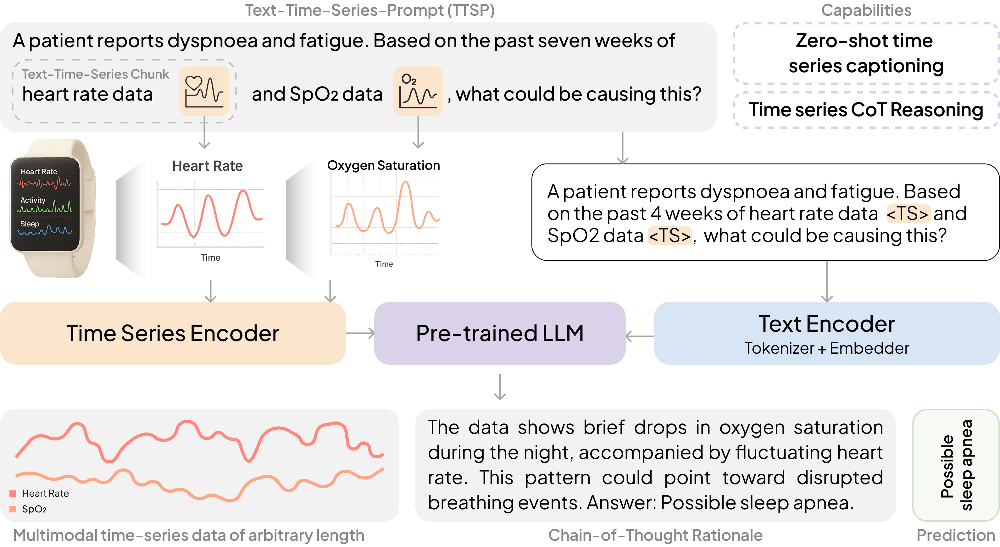
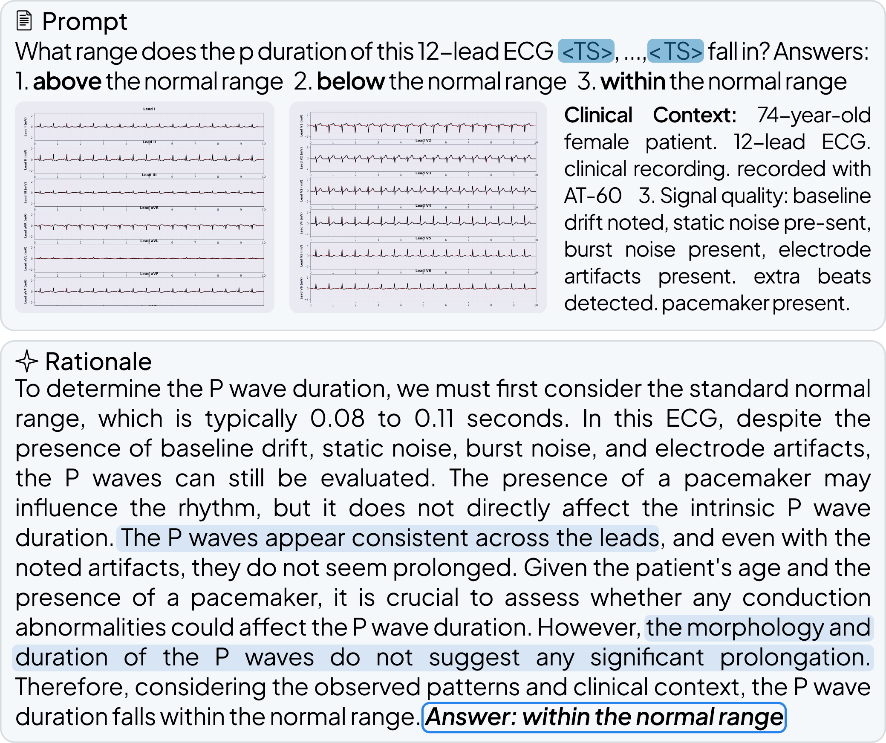
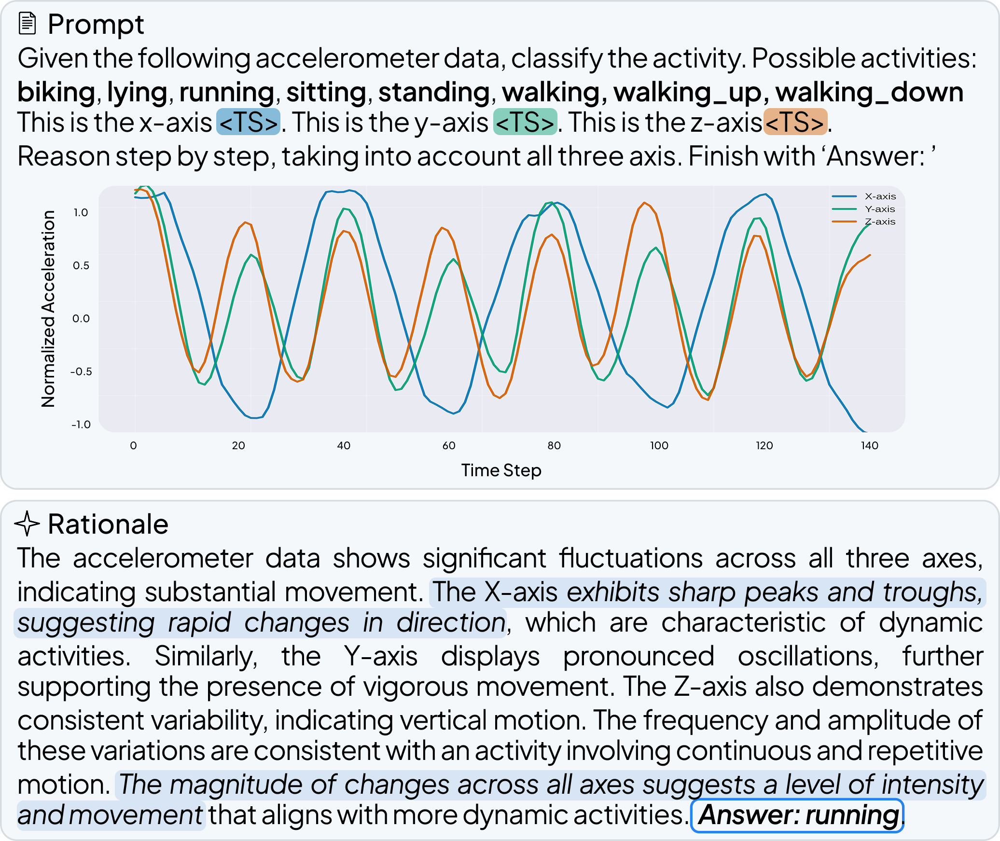
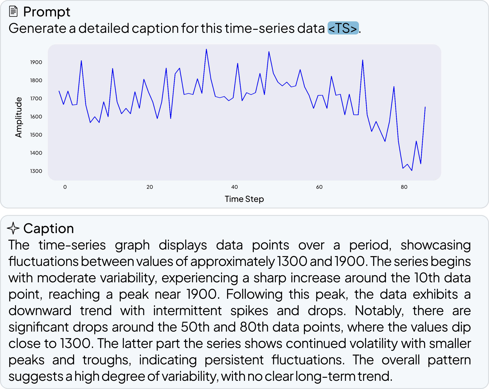
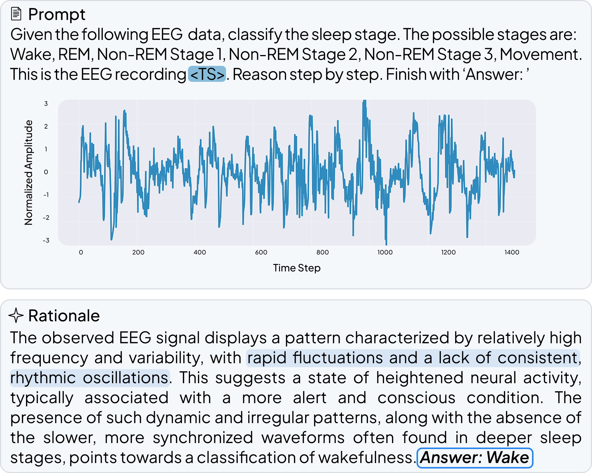

# OpenTSLM: Time-Series Language Models for Reasoning over Multivariate Medical Text- and Time-Series Data

> **Abstract**  
> Large Language Models (LLMs) have emerged as powerful tools for interpreting multimodal data (e.g., images, audio, text), often surpassing specialized models. In medicine, they hold particular promise for synthesizing large volumes of clinical information into actionable insights and patient-facing digital health applications.  Yet, a major limitation remains their inability to handle time series data. To overcome this gap, we present OpenTSLM, a family of Time Series Language Models (TSLMs) created by integrating time series as a native modality to pretrained Large Language Models, enabling natural-language prompting and reasoning over multiple time series of any length. We investigate two architectures that differ in how they model time series. The first, OpenTSLM-SoftPrompt, models time series implicitly by concatenating learnable time series tokens with text tokens via soft prompting. Although parameter-efficient, we hypothesize that explicit time series modeling scales better and outperforms implicit approaches. We thus introduce OpenTSLM-Flamingo, which integrates time series with text via cross-attention. We benchmark both variants with LLaMa and Gemma backbones against baselines that treat time series as text tokens or plots, across a suite of text–time-series reasoning tasks. We introduce three time-series Chain-of-Thought (CoT) datasets: HAR-CoT (human activity recognition), Sleep-CoT (sleep staging), and ECG-QA-CoT (ECG question answering). Across all, OpenTSLM models consistently outperform baselines, reaching 69.9% F1 in sleep staging and 65.4% in HAR, compared to 9.05% and 52.2% for finetuned text-only models. Notably, even 1B-parameter OpenTSLM models surpass GPT-4o (15.47% and 2.95%). OpenTSLM-Flamingo matches OpenTSLM-SoftPrompt in performance and outperforms on longer sequences, while maintaining stable memory requirements. By contrast, SoftPrompt exhibits exponential memory growth with sequence length, requiring ~110 GB compared to ~40 GB VRAM when training on ECG-QA with LLaMA-3B. Expert reviews by clinicians find strong reasoning capabilities and temporal understanding of raw sensor data exhibited by OpenTSLMs on ECG-QA. To facilitate further research, we provide all code, datasets, and models open-source.  


<p align="center">
  
</p>

## Examples

<p align="center">
  
  
</p>
<p align="center">
  
  
</p>

## Installation

1. **Clone the Repository**  
   ```bash
   git clone https://github.com/StanfordBDHG/EmbedHealth.git --recurse-submodules
   ```

2. **Install Dependencies**  
   ```bash
   pip install -r requirements.txt
   ```

## LLM Setup

EmbedHealth uses the Llama 3.2 1B model, which is stored in a Hugging Face repository which is restricted. Follow these steps to gain access and download:

1. **Request Access**  
   Submit a request to the repository administrator to gain read access.

2. **Authenticate with Hugging Face**  
   Log in to your Hugging Face account and configure the CLI:

   ```bash
   huggingface-cli login
   ```

3. **Create an API Token**  
   - Go to your Hugging Face settings: https://huggingface.co/settings/tokens
   - Generate a new token with `read` scope.
   - Copy the token for CLI login.

## Multi-stage training (Curriculum)

EmbedHealth uses curriculum learning with progressive training stages:

### Training Stages
1. **Stage 1 (MCQ)**: Multiple choice questions on time series data
2. **Stage 2 (Captioning)**: Generate detailed captions for time series

> **⚠️ MPS/CUDA Compatibility Warning:**
> 
> If you are using Apple's MPS (Metal Performance Shaders) backend (e.g., on Mac with Apple Silicon), you may encounter issues with training or inference. **Checkpoints trained with CUDA (NVIDIA GPUs) may not yield good results or may not be fully compatible when loaded and run on MPS.** For best results, use the same device type (CUDA or MPS) for both training and inference. CUDA is preferred in general.
### Quick Start
```bash
# Run full curriculum with EmbedHealthFlamingo
python curriculum_learning.py --model EmbedHealthSP

# Run full curriculum with EmbedHealthSP
python curriculum_learning.py --model EmbedHealthFlamingo

# Run only MCQ stage
python curriculum_learning.py --model EmbedHealthFlamingo --stages stage1_mcq

# Run only captioning stage
python curriculum_learning.py --model EmbedHealthFlamingo --stages stage2_captioning

# Specify device
python curriculum_learning.py --model EmbedHealthFlamingo --device cuda

# Run only evaluation
python curriculum_learning.py --model EmbedHealthFlamingo --eval_only
```

### Command Line Arguments

- `--model`: Model type (`EmbedHealthSP` or `EmbedHealthFlamingo`)
- `--stages`: Stages to run (`stage1_mcq`, `stage2_captioning`, or both)
- `--device`: Device to use (`cuda`, `mps`, `cpu`)
- `--eval_only`: Run evaluation only (requires an existing checkpoint for the stage)

## 📁 Results Structure

During training, the scripts creates a structured results directory:

```
results/
├── EmbedHealthSP/
│   ├── stage1_mcq/
│   │   ├── checkpoints/
│   │   │   └── best_model.pt
│   │   └── results/
│   │       ├── test_predictions.jsonl
│   │       └── metrics.json
│   ├── stage2_captioning/
│   │   ├── checkpoints/
│   │   │   └── best_model.pt
│   │   └── results/
│   │       ├── test_predictions.jsonl
│   │       └── metrics.json
│   └── curriculum_results.json
└── EmbedHealthFlamingo/
    ├── stage1_mcq/
    │   ├── checkpoints/
    │   │   └── best_model.pt
    │   └── results/
    │       ├── test_predictions.jsonl
    │       └── metrics.json
    ├── stage2_captioning/
    │   ├── checkpoints/
    │   │   └── best_model.pt
    │   └── results/
    │       ├── test_predictions.jsonl
    │       └── metrics.json
    └── curriculum_results.json
```

Each stage automatically loads the best model from the previous stage, ensuring proper curriculum progression. Results are saved in `results/{model_name}/{stage_name}/`.


## Contributors
This work was made possible only by joint effort of many awesome collaborators:

- Patrick Langer (Stanford, ETH Zurich)
- Thomas Kaar (Stanford, TUM)
- Max Rosenblattl (Stanford, TUM)
- Maxwell A. Xu (Google Research, University of Illinois Urbana-Champaign)
- Winnie Chow (Stanford)
- Martin Maritsch (Amazon)
- Daniel McDuff (Google Research, University Washington)
- Elgar Fleisch (ETH Zurich)
- Filipe Barata (ETH Zurich)
- Paul Schmiedmayer (ETH Zurich)

<div align="center">
  &nbsp;&nbsp;&nbsp;&nbsp;&nbsp;&nbsp;&nbsp;&nbsp;&nbsp;&nbsp;&nbsp;&nbsp;&nbsp;&nbsp;
  
</div>

## Contributing

Contributions to this project are welcome. Please make sure to read the [contribution guidelines](https://github.com/StanfordSpezi/.github/blob/main/CONTRIBUTING.md) and the [contributor covenant code of conduct](https://github.com/StanfordSpezi/.github/blob/main/CODE_OF_CONDUCT.md) first.


## License

This project is licensed under the MIT License. 
