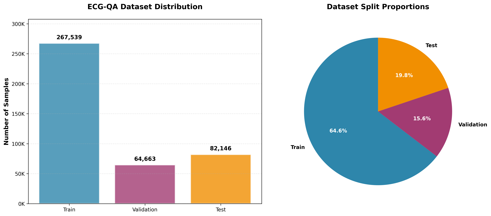
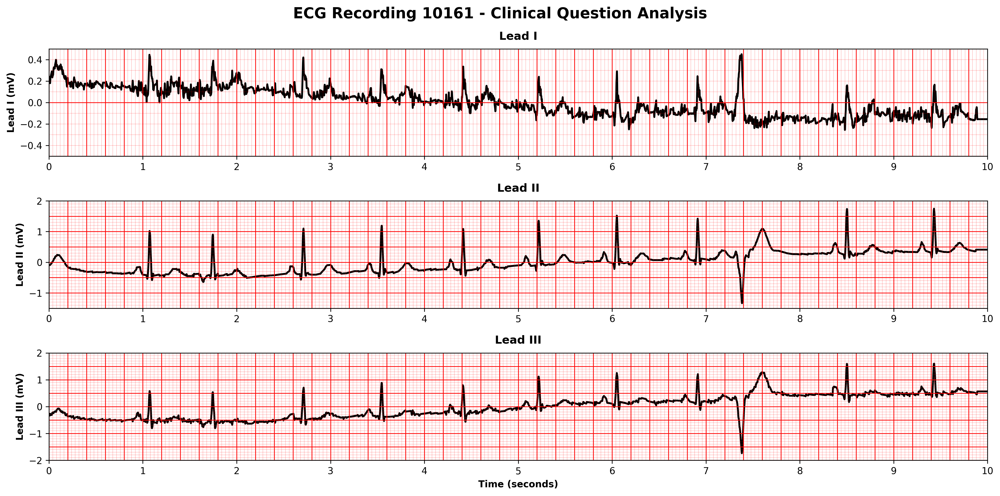

# ECG-QA Dataset Integration

ECG-QA is one of the core training datasets for **OpenTSLM**, providing comprehensive question-answering capabilities for electrocardiogram analysis. This dataset combines ECG time series data from PTB-XL with diverse medical questions, enabling text-time series LLMs to perform clinical ECG interpretation.

## Dataset Overview

ECG-QA contains single-ECG and multi-ECG questions. Multi-ECG questions are about comparing two ECGs. The latter are not used for training OpenTSLM.

### Full Dataset (All Question Types)

| Split          | Samples     | Description                                  |
| -------------- | ----------- | -------------------------------------------- |
| **Train**      | 267,539     | Training samples for model learning          |
| **Validation** | 64,663      | Validation samples for hyperparameter tuning |
| **Test**       | 82,146      | Test samples for final evaluation            |
| **Total**      | **414,348** | Complete ECG question-answering dataset      |

### Filtered Dataset (Single Questions Only, `exclude_comparison=True`)

| Split          | Samples     | Removed     | Description                                     |
| -------------- | ----------- | ----------- | ----------------------------------------------- |
| **Train**      | 159,306     | 108,233     | Single-question training samples                |
| **Validation** | 31,137      | 33,526      | Single-question validation samples              |
| **Test**       | 41,093      | 41,053      | Single-question test samples                    |
| **Total**      | **231,536** | **182,812** | Filtered dataset excluding comparison questions |

**Note:** The filtered dataset excludes all comparison questions (those requiring analysis of multiple ECGs).



## Example ECG Analysis



**Clinical Context:** 76-year-old male patient. 12-lead ECG clinical recording. Signal quality: baseline drift noted, static noise present, burst noise present, electrode artifacts present. Extra beats detected during recording. Pacemaker present.

**Question:** Does this ECG show symptoms of non-diagnostic t abnormalities?

**Expected Answer:** yes

This example demonstrates how OpenTSLM processes ECG signals on a millimeter paper grid (similar to clinical practice) and answers specific diagnostic questions about cardiac conditions.

### Relationship to PTB-XL

ECG-QA leverages the **PTB-XL dataset** (21,799 unique ECG recordings) by creating **multiple medical questions per ECG**:

- **Base Dataset**: PTB-XL contains 21,799 clinical 12-lead ECG recordings
- **Question Multiplication**: Each ECG receives ~19 different diagnostic questions on average
- **Result**: 414,348 question-answer pairs from systematic medical questioning
- **Coverage**: Questions span rhythm analysis, morphology detection, and pathology identification

This approach mirrors real clinical practice where cardiologists ask multiple diagnostic questions about each ECG recording.

## Example Prompt

Here's how ECG-QA data appears when processed through the OpenTSLM pipeline:

```
=== PRE-PROMPT ===
You are an expert cardiologist analyzing an ECG (electrocardiogram).

Clinical Context: 76-year-old male patient. 12-lead ECG clinical recording.
Signal quality: baseline drift noted, static noise present. Extra beats detected
during recording. Pacemaker present.

Your task is to examine the ECG signal and answer a specific medical question about it.

=== QUESTION ===
Does this ECG show symptoms of non-diagnostic t abnormalities?

=== ECG SIGNAL DATA ===
ECG Lead I - sampled at ~100Hz, normalized (mean=0.003, std=0.132)
[Time series data: 1000 samples over 10 seconds]

ECG Lead II - sampled at ~100Hz, normalized (mean=-0.001, std=0.359)
[Time series data: 1000 samples over 10 seconds]

... (6 total ECG leads: I, II, III, aVR, aVL, aVF)

=== POST-PROMPT ===
Based on your analysis of the ECG data, select your answer from the following options:
yes, no, not sure

Provide a brief explanation of your reasoning, then end your response with:
Answer: <your_answer>

=== EXPECTED ANSWER ===
yes
```

## Quick Start

```python
from time_series_datasets.ecg_qa.ECGQADataset import ECGQADataset

# Load ECG-QA splits (auto-downloads ~6GB of data on first run)
train_dataset = ECGQADataset(split="train", EOS_TOKEN="")
val_dataset = ECGQADataset(split="validation", EOS_TOKEN="")
test_dataset = ECGQADataset(split="test", EOS_TOKEN="")

print(f"Full dataset - Train: {len(train_dataset):,} samples")
print(f"Full dataset - Validation: {len(val_dataset):,} samples")
print(f"Full dataset - Test: {len(test_dataset):,} samples")

# Load filtered dataset (single questions only, excludes comparison questions)
train_filtered = ECGQADataset(split="train", EOS_TOKEN="", exclude_comparison=True)
val_filtered = ECGQADataset(split="validation", EOS_TOKEN="", exclude_comparison=True)
test_filtered = ECGQADataset(split="test", EOS_TOKEN="", exclude_comparison=True)

print(f"Filtered dataset - Train: {len(train_filtered):,} samples")
print(f"Filtered dataset - Validation: {len(val_filtered):,} samples")
print(f"Filtered dataset - Test: {len(test_filtered):,} samples")

# Examine a sample
sample = train_dataset[0]
print(f"Pre-prompt: {sample['pre_prompt'][:100]}...")
print(f"Answer: {sample['answer']}")
print(f"Question type: {sample['question_type']}")
print(f"Template ID: {sample['template_id']}")
print(f"ECG leads: {len(sample['time_series_text'])}")
```

## Data Structure

Each ECG-QA sample contains:

### Core Fields

- **question**: Medical question about the ECG (embedded in pre_prompt)
- **answer**: Clinical answer ("yes", "no", "not sure", specific values)
- **question_type**: Question category ("single-verify", "single-choice", "comparison")
- **ecg_id**: PTB-XL record ID(s) for the ECG signal(s)

### OpenTSLM-Specific Fields

- **time_series_text**: ECG leads as TextTimeSeriesPrompt objects
- **pre_prompt**: Complete clinical context, question, and cardiologist role setting
- **post_prompt**: Answer formatting instructions
- **primary_clinical_context**: Safe patient metadata (age, sex, recording quality)

## Question Categories

ECG-QA covers comprehensive cardiac analysis:

### Diagnostic Questions

- **Rhythm Analysis**: "Is the heart rhythm regular?"
- **Morphology Detection**: "Are there abnormal Q waves?"
- **Pathology Identification**: "Does this show signs of myocardial infarction?"
- **T-wave Abnormalities**: "Does this ECG show symptoms of non-diagnostic t abnormalities?"

### Question Types

- **single-verify**: Binary yes/no diagnostic questions
- **single-choice**: Multiple choice with specific options
- **comparison**: Multi-ECG comparative analysis

## Data Download & Storage

### Automatic Downloads

1. **ECG-QA Repository** (~145MB): Question-answer pairs and templates
2. **PTB-XL Dataset** (~6GB): Complete ECG recordings and metadata

### Directory Structure

```
data/
├── ecg_qa/              # ECG-QA repository
│   └── ecgqa/
│       └── ptbxl/
│           ├── template/  # Template questions (used in OpenTSLM)
│           └── paraphrase/  # Paraphrased variants
└── ptbxl/               # PTB-XL ECG dataset
    ├── records500/      # ECG signal files (.dat/.hea)
    ├── ptbxl_database.csv  # Patient metadata
    └── scp_statements.csv  # Diagnostic codes
```

### Metadata Sources

- **Demographics**: Age, sex (when available)
- **Recording Quality**: Signal artifacts, electrode issues
- **Technical Details**: Device type, recording conditions
- **Safety**: No diagnostic information that could bias answers

## Testing & Validation

```bash
# Test the complete pipeline
python -m time_series_datasets.ecg_qa.ecgqa_loader

# Or run specific tests
python test_ecgqa.py
```

### Validation Checks

- ✅ Data download integrity
- ✅ ECG signal loading from PTB-XL
- ✅ Question-answer pair consistency
- ✅ Clinical context generation
- ✅ Text-time series formatting

## Example Usage in OpenTSLM

```python
# Sample ECG-QA data for OpenTSLM training
sample = train_dataset[0]

print("=== ECG-QA Sample ===")
print(f"Pre-prompt: {sample['pre_prompt'][:200]}...")
print(f"Answer: {sample['answer']}")
print(f"Question Type: {sample['question_type']}")
print(f"ECG Record(s): {sample['ecg_id']}")
print(f"Clinical Context: {sample['primary_clinical_context']}")

# ECG signal data
for i, lead in enumerate(sample['time_series_text']):
    print(f"Lead {i+1}: {lead.text[:100]}...")
```

## References & Citations

### ECG-QA Paper

```bibtex
@article{oh2023ecg,
  title={Ecg-qa: A comprehensive question answering dataset combined with electrocardiogram},
  author={Oh, Jungwoo and Lee, Gyubok and Bae, Seongsu and Kwon, Joon-myoung and Choi, Edward},
  journal={Advances in Neural Information Processing Systems},
  volume={36},
  pages={66277--66288},
  year={2023}
}
```

**Paper**: [ECG-QA: A Comprehensive Question Answering Dataset Combined With Electrocardiogram](https://arxiv.org/abs/2306.15681)

**Original Repository**: https://github.com/Jwoo5/ecg-qa

### PTB-XL Paper

```bibtex
@article{wagner2020ptb,
  title={PTB-XL, a large publicly available electrocardiography dataset},
  author={Wagner, Patrick and Strodthoff, Nils and Bousseljot, Ralf-Dieter and Kreiseler, Dieter and Lunze, Franziska I and Samek, Wojciech and Schaeffter, Tobias},
  journal={Nature Scientific Data},
  volume={7},
  number={1},
  pages={1--15},
  year={2020}
}
```

**Paper**: [PTB-XL, a large publicly available electrocardiography dataset](https://www.nature.com/articles/s41597-020-0495-6)
